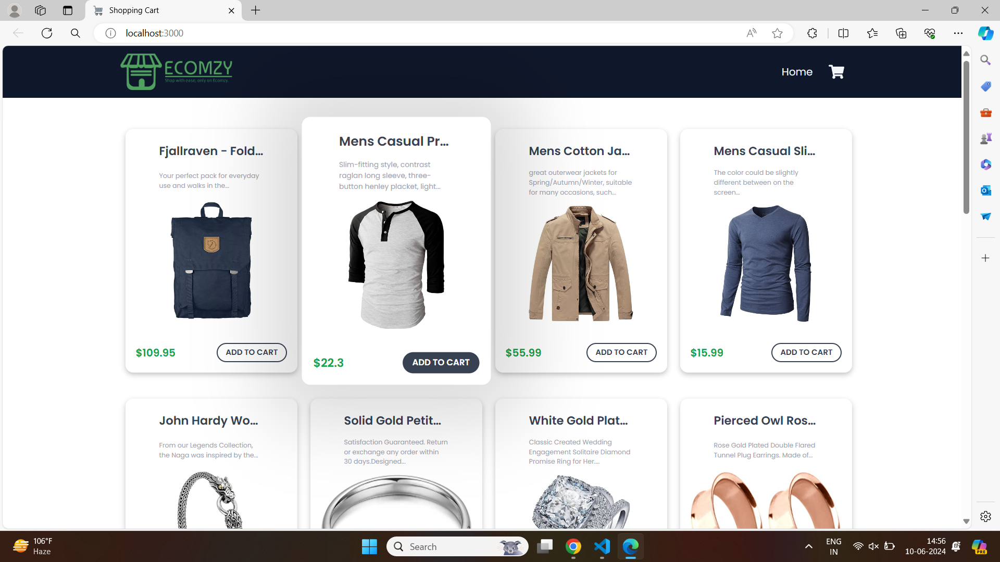
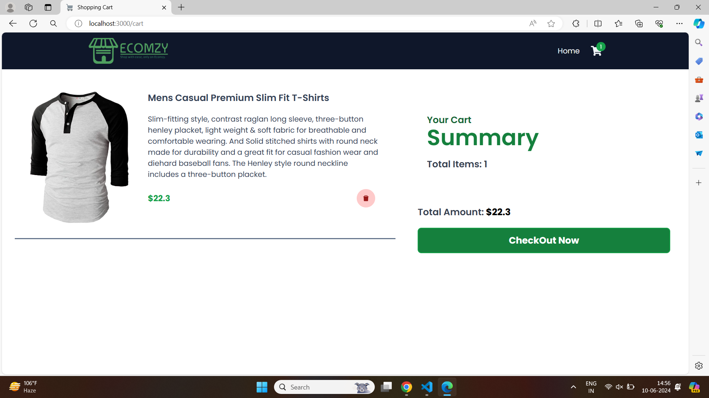
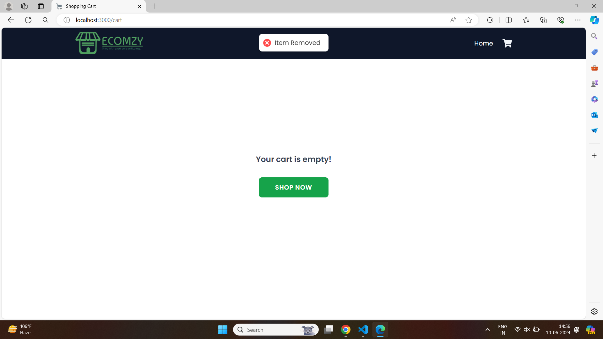

# Shop App

## Overview

Shop App is a modern web application designed to simplify the shopping experience. Users can browse products, add items to their cart .

## Screenshots

### Home Page

### Shopping Cart

### Empty Cart

## Features

- User-friendly interface for browsing products
- Detailed product descriptions and images
- Shopping cart functionality with the ability to add, remove, and update items

## Installation

Follow these steps to set up and run the Shop App on your local machine.

### Prerequisites

- Node.js and npm installed

### Setup

1. **Clone the repository:**

2. **Install dependencies:**

3. **Run the application:**

